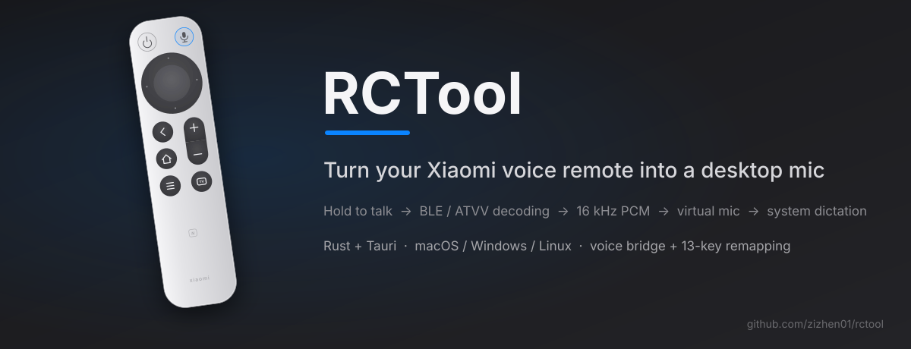

<p align="center">
  
</p>

<p align="center"><a href="README.md">中文</a> | English</p>

**Currently supported:**

- Xiaomi Bluetooth Remote v2 (RC001)
- Xiaomi Bluetooth Remote v2 Pro (RC003)

There are many remotes out there — PRs adding support for more models are welcome.

## Quick Start (macOS)

1. Pair the remote in System Settings → Bluetooth: hold **Home + Menu** to enter pairing mode; it shows up as `MI RC`
2. Launch the app: `cargo run -p rctool-tray`, or grab the dmg from Releases
3. On the Connection page pick **BlackHole 2ch** as the output device (the app offers one-click install if missing; the full dmg ships the installer built in)
4. System Settings → Keyboard → Dictation: enable it, set the shortcut to **hold 🌐**, and select BlackHole 2ch as the microphone source
5. Hold the remote's mic button and speak; release to finish

Key remapping (optional): open the Keys page, click a button on the remote diagram to remap it. Requires Input Monitoring and Accessibility permissions.

Want one app to behave differently (say OK sends Space inside a video player)? Add an override layer for it on the Apps page — you only write the keys that differ from the global map, and it kicks in whenever that app is in front.

## Usage

```bash
# GUI: main window + menu bar tray
cargo run -p rctool-tray

# CLI
cargo run -p rctool-cli --release -- outputs            # list audio output devices
cargo run -p rctool-cli --release -- scan               # find the remote
cargo run -p rctool-cli --release -- run --output BlackHole   # run the bridge
cargo run -p rctool-cli --release -- run --wav test.wav       # debug: dump voice to wav
```

## Platforms

| Platform | Voice → virtual mic | Dictation trigger | Key remapping |
| --- | --- | --- | --- |
| macOS | ✅ BlackHole (bundled installer in full edition / brew·web guidance in lite) | Hold mic button to dictate (device-scoped F5→Fn remap) | ✅ 13-key visual remapping + per-app overrides |
| Windows | ✅ VB-Cable (one-click fetch from the official source) | Auto Win+H on voice | Not yet |
| Linux | ✅ One-click null-sink, nothing to download | No system dictation; virtual mic only | Not yet |

## Development

```bash
cargo test -p rctool-core        # core logic unit tests
cargo run -p rctool-tray         # run the GUI (static frontend, no node needed)
cd apps/tray && npx --yes @tauri-apps/cli@2 build   # local bundling
git tag v0.1.0 && git push --tags                   # CI builds installers for all 3 platforms (draft Release)
```

More docs: [apps/tray/README.md](apps/tray/README.md) (architecture, per-platform differences, packaging),
[THIRD_PARTY_NOTICES.md](THIRD_PARTY_NOTICES.md) (BlackHole bundling license notes).

## License

GPL-3.0-only. Protocol details and decoder logic derive from [nijez/open-voice-bridge](https://github.com/nijez/open-voice-bridge) (GPL-3.0).
