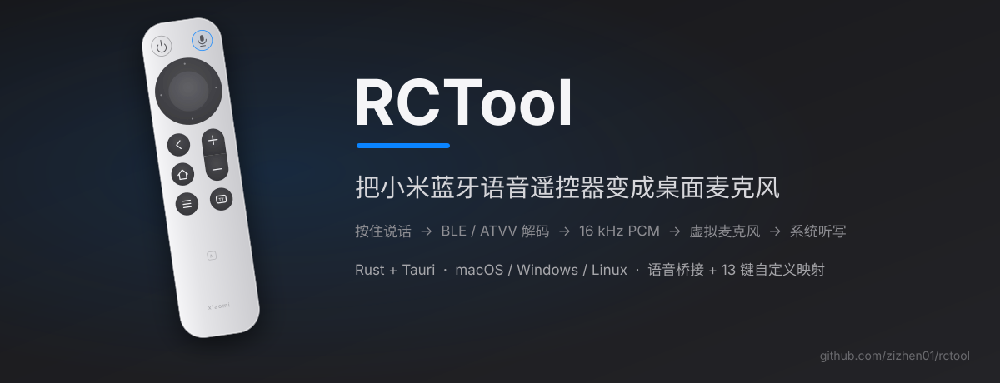

<p align="center">
  
</p>

小米蓝牙语音遥控器（2 Pro / RC003、普通款 / ARN9）配对电脑后按键就能用，
但语音走的是 Google 的 ATVV 私有 GATT 协议，桌面系统不认识。**RCTool**
在桌面侧扮演 Android TV：解码 16 kHz 语音写入回环声卡成为虚拟麦克风，
配合系统听写做到「按住遥控器说话，文字进任何输入框」；同时可修正按键的
桌面怪癖（TV 键打出反引号、电源键弹关机框、返回键完全失灵）。

> ⚠️ 代码完成、CI 三平台全绿，但尚未接真实遥控器完成真机验收。

## 快速开始（macOS）

1. 系统蓝牙里配对遥控器：长按 主页+菜单 进入配对，设备名 `MI RC`
2. 启动应用：`cargo run -p rctool-tray`，或从 Releases 下载 dmg
3. 连接页选择输出设备 **BlackHole 2ch**（未安装时应用内有「安装 BlackHole」一键引导；full 版 dmg 已内置安装器）
4. 系统设置 → 键盘 → 听写：开启，快捷键选「按住 🌐」，麦克风来源选 BlackHole 2ch
5. 按住遥控器麦克风键说话，松开结束

按键映射（可选）：设置窗「按键」页点实物图改键，需要输入监控与辅助功能权限。

## 用法

```bash
# 图形界面：主窗口 + 菜单栏托盘
cargo run -p rctool-tray

# 命令行
cargo run -p rctool-cli --release -- outputs            # 列音频输出设备
cargo run -p rctool-cli --release -- scan               # 查找遥控器
cargo run -p rctool-cli --release -- run --output BlackHole   # 运行桥接
cargo run -p rctool-cli --release -- run --wav test.wav       # 调试：语音落 wav
```

## 平台

| 平台 | 语音 → 虚拟麦克风 | 听写触发 | 按键映射 |
| --- | --- | --- | --- |
| macOS | ✅ BlackHole（full 版内置安装器 / lite 版 brew·官网引导） | 按住麦克风键即听写（F5→Fn 设备级重映射） | ✅ 13 键图形化映射 |
| Windows | ✅ VB-Cable（应用内从官方源一键获取） | 语音时自动 Win+H | 暂未实现 |
| Linux | ✅ 一键创建 null-sink，零下载 | 无系统听写，仅虚拟麦克风 | 暂未实现 |

## 开发

```bash
cargo test -p rctool-core        # 核心逻辑单元测试
cargo run -p rctool-tray         # 起 GUI（前端纯静态，无 node 依赖）
cd apps/tray && npx --yes @tauri-apps/cli@2 build   # 本地打包
git tag v0.1.0 && git push --tags                   # CI 出三平台安装包（Release 草稿）
```

细节文档：[apps/tray/README.md](apps/tray/README.md)（架构、三平台差异、打包）、
[THIRD_PARTY_NOTICES.md](THIRD_PARTY_NOTICES.md)（full 版内嵌 BlackHole 的许可说明）。

## 许可证

GPL-3.0-only。协议细节与解码逻辑源自 [nijez/open-voice-bridge](https://github.com/nijez/open-voice-bridge)（GPL-3.0）。
